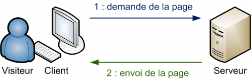

class: middle

<h1>Programmation web</h1>

### Cours 1

#### PHP

#### Créé par Mikaël Ruffieux, 04.2021

---

# Comment fonctionne une page web

### Concrètement ...

Quand vous allez sur la page [wikipedia.org/wiki/Roger_Federer](https://fr.wikipedia.org/wiki/Roger_Federer), vous demandez au serveur de Wikipedia d'afficher la page `Roger_Federer`.

Le serveur va chercher la page en question, et vous l'affiche.

---

# PHP

<!-- ### Fin du document ### -->