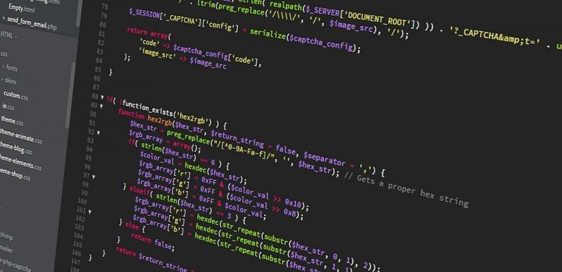

class: middle

<h1><span class="secondary-color">Programmation</span><br/>web</h1>

### Cours 3

#### PHP

#### Créé par Mikaël Ruffieux, 04.2021



---

## Petit <span class="secondary-color">rappel</span>

- Nous avons vu les semaines précédentes différents **types de données**, citez-moi ceux dont vous vous souvenez.

- Je souhaite compter le nombre de **mots** que j'ai dans une **chaîne de caractères**, quelle fonction dois-je utiliser : `strlen()` ou `str_word_count()` ?

- Je souhaite créer un nombre aléatoire entre 1 et 10. Quelle fonction vais-je utiliser : `pi()`, `max()`, `rand()` ou `round()` ?

---

## Solutions

- Nous avons vu les semaines précédentes différents **types de données**, citez-moi ceux dont vous vous souvenez.

*Les chaînes de caractères, les nombres, les booléens et les tableaux*.

- Je souhaite compter le nombre de **mots** que j'ai dans une **chaîne de caractères**, quelle fonction dois-je utiliser : `strlen()` ou `str_word_count()` ?

*`strlen()` retourne le nombre de caractères dans la chaîne, tandis que `str_word_count()` retourne le nombre de mots.*

- Je souhaite créer un **nombre aléatoire** entre 1 et 10. Quelle fonction vais-je utiliser : `pi()`, `max()`, `rand()` ou `round()` ?

*`pi()` retourne 3.14... , `max()` retournera le chiffre le plus grand donné en argument, et `round()` arrondira le chiffre donnée en argument à l'entier le plus proche (un entier est un nombre sans virgule).*

*`rand(1, 10)` nous retournera un chiffre aléatoire entre 1 et 10.*


---

## Les <span class="secondary-color">booléens</span>

Un booléen est un type de donnée à 2 états. Soit il est vrai, soit il est faux. Soit il est actif, soit il est inactif.

En programmation, on a 2 manières de noter un booléen : 

- Soit en utilisant les termes anglais : `true` ou `false`;
- Soit en utilisant les chiffres `0` et `1`. 

<br>
<small><i>C'est de là que vient le bouton d'allumage : une combinaison d'un `0` et d'un `1`.</i></small>


---

## <span class="secondary-color">Comparer</span> des valeurs

Les booléens sont principalement utilisés pour **comparer des valeurs** :

- `a == b` : `a` et `b` sont-ils **égaux** ?
- `a != b` : `a` et `b` sont-ils **inégaux** ?

- `a > b` : `a` est-il plus grand que `b` ?
- `a >= b` : `a` est-il plus grand ou égal à `b` ?

- `a < b` : `a` est-il plus grand que `b` ?
- `a <= b` : `a` est-il plus grand ou égal à `b` ?

<br>

*Moins utilisés :*

- `a === b`: `a` et `b` sont-ils égaux aussi selon leurs **types** ? Par exemple, est-ce que `'1'` est égal à `1`?

---

## <span class="secondary-color">Comparer</span> des valeurs

### Exercice

- `1 > 2` ?
- `3 <= 10` ?
- `1 == 5` ?
- `1 != 10` ?

Et cela fonctionne aussi avec les chaînes de caractères : 

- `"Michel" == "Mikael"` ?

*On n'utilise que très peu les autres comparateurs sur du texte.*

---

## <span class="secondary-color">Comparer</span> des valeurs

### Exercice

- `1 > 2` ?   `false`
- `3 <= 10` ?   `true`
- `1 == 5` ?   `false`
- `1 != 10` ?   `true`

Et cela fonctionne aussi avec les chaînes de caractères : 

- `"Michel" == "Mikael"` ?   `false`

*On n'utilise que très peu les autres comparateurs sur du texte.*

---

## <span class="secondary-color">Combiner</span> des booléens

On a parfois besoin de comparer plus de **deux éléments**. On peut pour cela **combiner nos comparaisons**, à l'aide des symboles suivants :

- `&&` ou `AND` : seulement si les deux sont `true` : retourne `true` ;

- `||` ou `OR`: si l'un des deux est `true`: retourne `true`.

---

## Table de vérité : <span class="secondary-color">AND</span>

<table style="text-align: left;" class="styled-table">
    <tr>
        <th colspan="2">Entrées</th>
        <th>Sortie</th>
    </tr>
    <tr>
        <td>A</td>
        <td>B</td>
        <td>A ET B</td>
    </tr>
    <tr>
        <td>false</td>
        <td>false</td>
        <td>?</td>
    </tr>
    <tr>
        <td>false</td>
        <td>true</td>
        <td>?</td>
    </tr>
    <tr>
        <td>true</td>
        <td>false</td>
        <td>?</td>
    </tr>
    <tr>
        <td>true</td>
        <td>true</td>
        <td>?</td>
    </tr>
</table>

---

## Table de vérité : <span class="secondary-color">AND</span>

<table style="text-align: left;" class="styled-table">
    <tr>
        <th colspan="2">Entrées</th>
        <th>Sortie</th>
    </tr>
    <tr>
        <td>A</td>
        <td>B</td>
        <td>A ET B</td>
    </tr>
    <tr>
        <td>false</td>
        <td>false</td>
        <td>false</td>
    </tr>
    <tr>
        <td>false</td>
        <td>true</td>
        <td>false</td>
    </tr>
    <tr>
        <td>true</td>
        <td>false</td>
        <td>false</td>
    </tr>
    <tr>
        <td>true</td>
        <td>true</td>
        <td>true</td>
    </tr>
</table>

---

## Table de vérité : <span class="secondary-color">OR</span>

<table style="text-align: left;" class="styled-table">
    <tr>
        <th colspan="2">Entrées</th>
        <th>Sortie</th>
    </tr>
    <tr>
        <td>A</td>
        <td>B</td>
        <td>A OU B</td>
    </tr>
    <tr>
        <td>false</td>
        <td>false</td>
        <td>?</td>
    </tr>
    <tr>
        <td>false</td>
        <td>true</td>
        <td>?</td>
    </tr>
    <tr>
        <td>true</td>
        <td>false</td>
        <td>?</td>
    </tr>
    <tr>
        <td>true</td>
        <td>true</td>
        <td>?</td>
    </tr>
</table>

---

## Table de vérité : <span class="secondary-color">OR</span>

<table style="text-align: left;" class="styled-table">
    <tr>
        <th colspan="2">Entrées</th>
        <th>Sortie</th>
    </tr>
    <tr>
        <td>A</td>
        <td>B</td>
        <td>A OU B</td>
    </tr>
    <tr>
        <td>false</td>
        <td>false</td>
        <td>false</td>
    </tr>
    <tr>
        <td>false</td>
        <td>true</td>
        <td>true</td>
    </tr>
    <tr>
        <td>true</td>
        <td>false</td>
        <td>true</td>
    </tr>
    <tr>
        <td>true</td>
        <td>true</td>
        <td>true</td>
    </tr>
</table>

---

## Les instructions <span class="secondary-color">conditionnelles</span>

L'instruction `if` est une des instructions **les plus importantes en programmation**. 

Cette instruction permet d'exécuter une portion de code si son argument est `true` :

```php
if($a > $b) {
    echo "a est plus grand que b.";
}
```

---

## Les instructions <span class="secondary-color">conditionnelles</span>

Nous pouvons ajouter d'autres instructions à notre `if` pour plus de précision.

On peut lister des autres actions si le `if`n'est pas `true` grâce  à l'instruction `elseif(...)`.

On peut finalement choisir une portion de code à exécuter si aucun des `if` ou `elseif` n'est vrai, grâce à l'instruction `else`.

```php
if($a > $b) {
    echo "a est plus grand que b.";
} elseif($a == $b) {
    echo "a est égal à b.";
} else {
    echo "a est plus petit que b.";
}
```

Il n'est pas nécessaire de toujours utiliser les 3 instructions. **À vous** d'adapter le code selon la situation.

---

## Exercice <span class="secondary-color">pratique</span> <br>version 1

Créez un script qui tire **2 nombres au hasard**, entre 1 et 10, et qui retourne `true`/`false` si le premier nombre est plus grand que le second : 

```php
$a = ... ;
$b = ... ;

echo $a ... $b ;

```

---

## Exercice <span class="secondary-color">pratique</span><br>version 2

À l'aide du squelette de code suivant et de l'exercice précédent, créez un script qui affiche selon la valeur des 2 nombres **lequel est plus grand que l'autre** : 

```php
$a = ... ;
$b = ... ;

if(...) {
    echo "$a est plus grand que $b.";

} elseif(...) {
    echo "$a est égal à $b.";

} ... {
    echo "$a est plus petit que $b.";

}
```

---

## Exercice <span class="secondary-color">pratique</span><br>version 3

Pour les plus avancé.e.s, créez un script qui va chercher dans un texte **la position de 2 mots stockés dans des variables**, et qui indique si les 2 mots sont identiques, et sinon, lequel est positionné en premier dans le texte.

```php
// Pour sélectionner le texte, triple-cliquez sur la ligne :
$texte = "Enigma est une machine électromécanique portative servant au chiffrement et au déchiffrement de l'information. Elle fut inventée par l'Allemand Arthur Scherbius, reprenant un brevet du Néerlandais Hugo Koch, datant de 1919. Enigma fut utilisée principalement par les Allemands pendant la Seconde Guerre mondiale. Le terme Enigma désigne en fait toute une famille de machines, car il en a existé de nombreuses et subtiles variantes, commercialisées en Europe et dans le reste du monde à partir de 1923. Elle fut aussi adoptée par les services militaires et diplomatiques de nombreuses nations. Son utilisation la plus célèbre fut celle faite par l'Allemagne nazie et ses alliés, avant et pendant la Seconde Guerre mondiale, la machine étant réputée inviolable selon ses concepteurs. Néanmoins un nombre important de messages Enigma ont pu être décryptés près de sept ans avant la guerre. Dès 1931, le Service français de renseignement était parvenu à recruter une source au sein même du bureau du chiffre du ministère de la Reichswehr. Il obtient de lui de premières copies de la documentation ; il les proposa à l'Intelligence Service britannique, qui se montra sceptique, et au service polonais, qui fut très intéressé. Une coopération s'instaura, qui allait durer jusqu'en 1939. Les Français continuèrent de fournir de nouveaux renseignements obtenus de la même source, et les Polonais montèrent une équipe qui parvint à reproduire la machine à partir de la documentation de plus en plus précise qui leur parvenait.";

$mot1 = "Enigma" ;
$mot2 = "Polonais" ;

if($mot1 ... $mot2) {
    echo "Les 2 mots sont identiques. Ils se situent à la position " 
        . strpos($texte, $mot1) . ".<br>";
} else {
    if(strpos(..., $mot1) < strpos($texte, ...)) {
        echo "'$mot1' est positionné avant '$mot2'.";
    } ... {
        echo "'$mot1' est positionné après '$mot2'.";
    }
}
```
