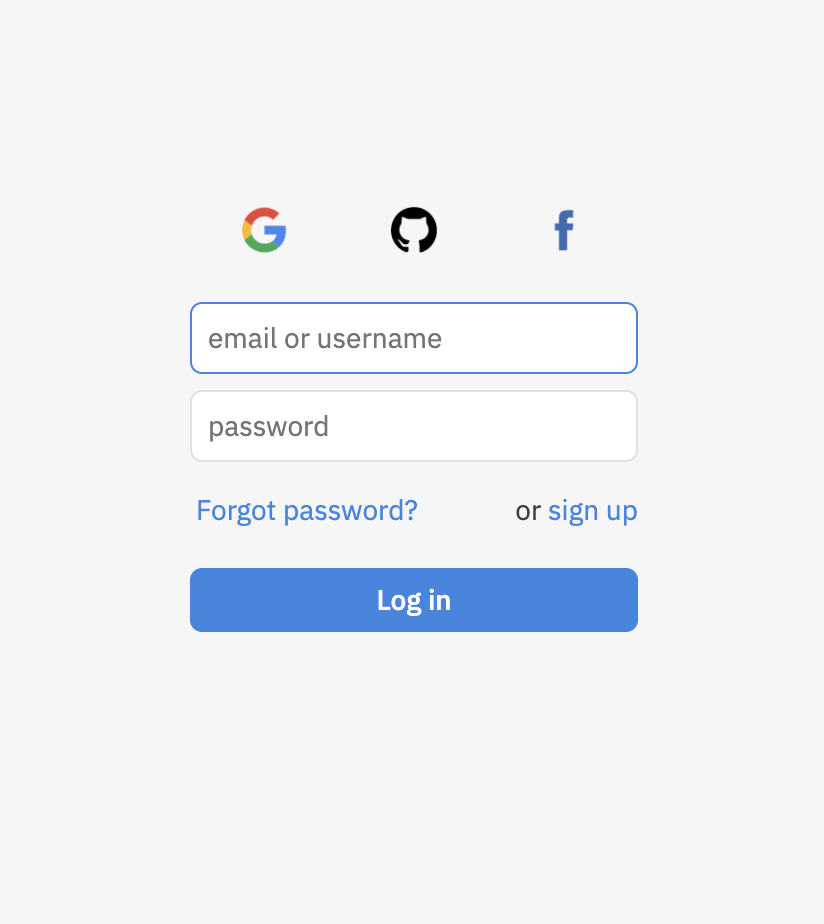

class: middle

<h1><span class="secondary-color">Programmation</span><br/>web</h1>

### Cours 9

#### PHP

#### Créé par Mikaël Ruffieux, 06.2021


---

## Rappel : <span class="secondary-color">POST</span> ou <span class="secondary-color">GET</span> ?

La méthode d'un formulaire se réfère à une **méthode HTTP**.

<table class="unstyled-table">
    <tr>
        <th><h3>POST</h3></th>
        <th><h3>GET</h3></th>
    </tr>
    <tr>
        <td>
            <ul>
                <li>Données transmises directement au serveur</li>
                <li>Plus "abstrait", mais plus sécurisé</li>
            </ul>
        </td>
        <td>
            <ul>
                <li>Donnée transmises via l'URL</li>
                <li>Plus simple</li>
            </ul>
        </td>
    </tr>
</table>

Donc si on transmet des informations **standards** *(nom d'une page, résultat d'un calcul, ...)*, on peut utiliser la méthode `GET`. 

Mais si on transmet des informations **confidentielles** et/ou **personnelles** *(e-mail, mot de passe, ...)*, on utilisera la méthode `POST`.

---

## <span class="secondary-color">Rappel</span>

Selon la méthode utilisée, on utilisera une méthode différente pour récupérer les données en PHP :

### `POST`

```php
<?php
echo $_POST['pseudo'];
```

### `GET`

```php
<?php
echo $_GET['pseudo'];
```

---

## Les <span class="secondary-color">types</span> d'input

```php
<input name="..." type="..." value="...">
```

La dernière fois, nous avons vu les `input` dans lesquels nous pouvons entrer du texte.

Quels **types** de texte pouvont-nous entrer dans un champ de formulaire ?

---

## Les <span class="secondary-color">types</span> d'input

```php
<input name="..." type="..." value="...">
```

La dernière fois, nous avons vu les `input` dans lesquels nous pouvons entrer du texte.

Quels **types** de texte pouvont-nous entrer dans un champ de formulaire ?

- `text`
- `number`
- `email`
- `password`

---

## Exercice de la <span class="secondary-color">semaine passée</span>




Enlevez sur votre page `index.php` le champ `email`.

Modifier votre page de résultats `resultats.php` pour que si l'utilisateur qui se connecte a comme pseudo `admin` et comme mot de passe `1234`, on affiche son pseudo et son mot de passe. Si le pseudo ou le mot de passe n'est pas correct, on affiche le texte suivante : "*Désolé, l'accès est refusé.*", avec un lien HTML qui permet de retourner à la page `index.php`.

---

## Les <span class="secondary-color">types</span> d'input

Il existe pourtant plusieurs **autres types** d'input.

- Les choix multiples ;
- Les cases à cocher ;
- Les listes de sélections.

Ces `input` sont spéciaux car ils ont **plusieurs options prédéfinies**, et donc des **sous-éléments** HTML.

---

## Les <span class="secondary-color">types</span> d'input

```php
<form action="resultats.php" method="post">
    <input >
    <!-- Choix multiples, ou bouton "radio" -->
    <input type="radio" id="homme" name="genre" value="M">
    <label for="homme">Homme</label>
    <input type="radio" id="femme" name="genre" value="F">
    <label for="femme">Femme</label>

    <!-- Cases à cocher -->
    <input type="checkbox" id="vehicule1" name="vehicule1" value="velo">
    <label for="vehicule1"> Vélo</label><br>
    <input type="checkbox" id="vehicule2" name="vehicule2" value="voiture">
    <label for="vehicule2"> Voiture</label><br>

    <!-- Liste de sélection -->
    <select name="animaux">
        <option value="chien">Chien</option>
        <option value="chat">Chat</option>
        <option value="hamster">Hamster</option>
    </select>
</form>
```

---

## <span class="secondary-color">Exercice</span>

Transformez votre formulaire de connexion en **formulaire d'inscription**. 

Votre formulaire devra prendre les informations suivantes sur ses utilisateurs :

- Son **prénom*** ;
- Son **âge*** ;
- Son **genre** (H/F)* ;
- Sa **ville** (en proposant dans une liste plusieurs villes) ;
- Les **langues parlées** (sous forme de cases à cocher).

*(Les champs marqués d'une astérisque sont obligatoires)*

---

## <span class="secondary-color">Exercice</span> (suite)

Sur la page de résultat, affichez le texte suivante, rempli automatiquement à partir des informations transmises via le formulaire : 

<hr>

Bonjour, je m'appelle *Mikaël*, j'ai *23* ans.

Je suis *un homme*, et j'habite à *Neuchâtel*.

Je parle :
- *Le français*
- *L'anglais*
- *L'allemand*

<hr>